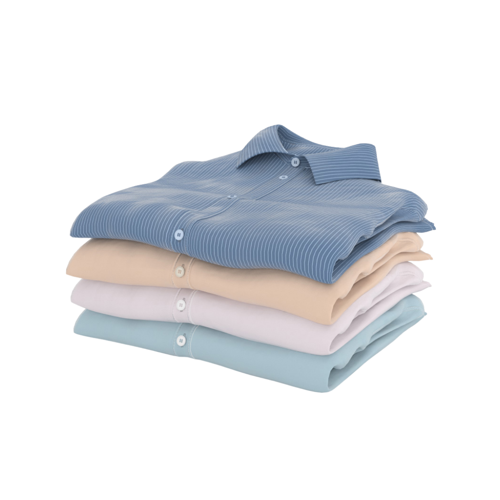
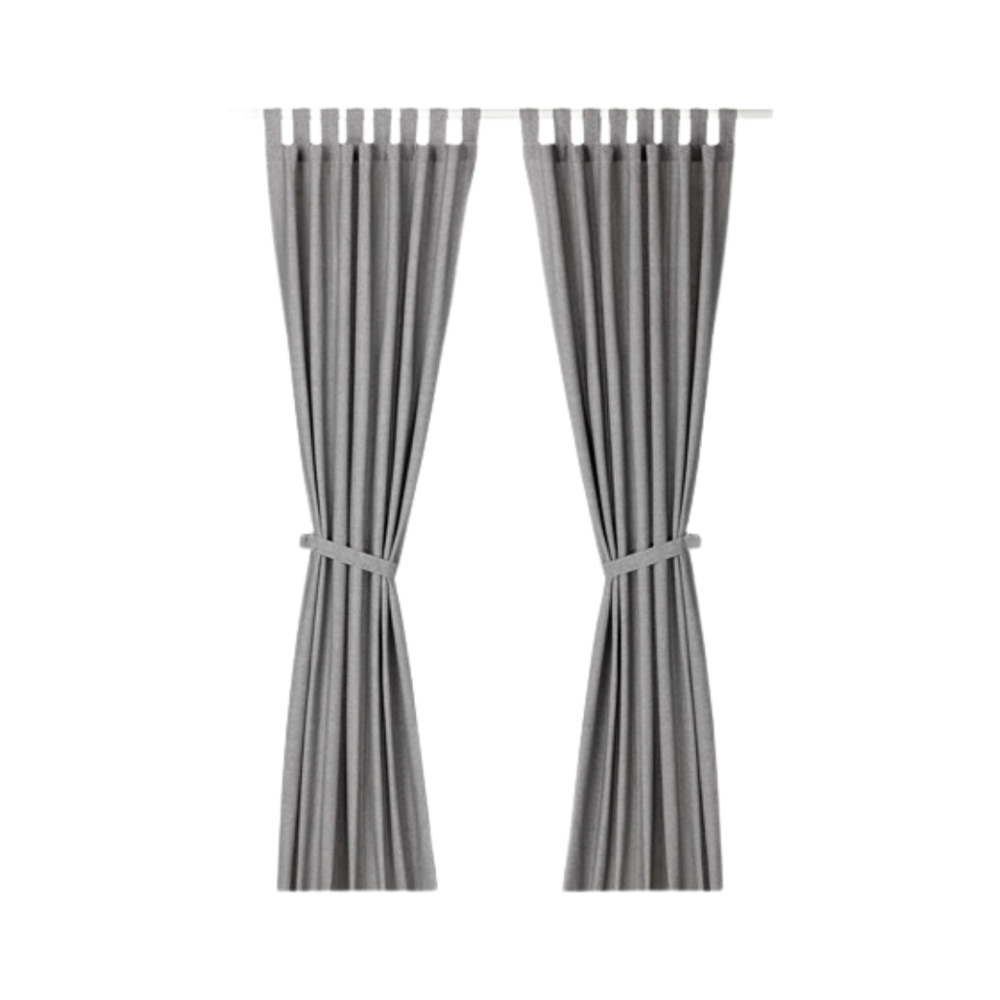
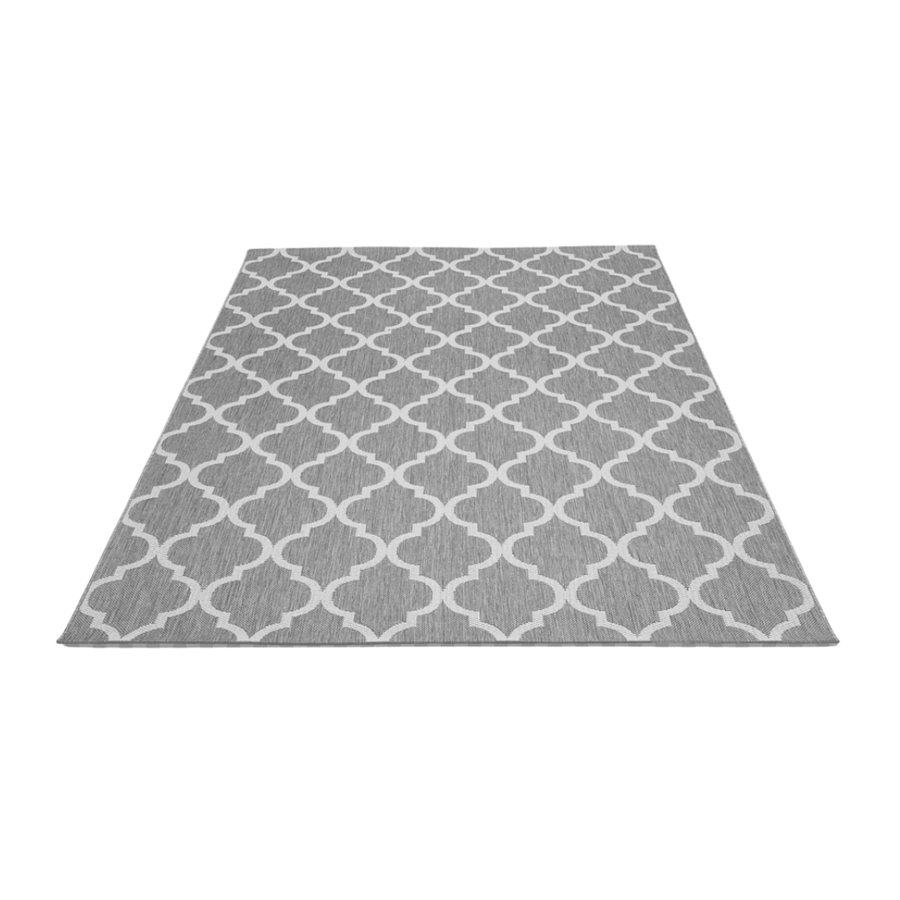

# LaundryWashology

<!DOCTYPE html>
<html lang="en">
<head>
    <meta charset="UTF-8">
    <meta name="viewport" content="width=device-width, initial-scale=1.0">
    <title>Washology Laundry</title>
    <link rel="stylesheet" href="style.css">
</head>
<body>
    <!--header-->
    <header>
        

            
            <h1>Laundry Washology</h1>
            <h1>Teknologi Mencuci, Hasil Tanpa Kompromi</h1>
            
1 Teknology Delivery Laundry In Surabaya 

            <a href="https://wa.me/089507344403" class="btn-whatsapp">Pesan Sekarang</a>
        

    </header>

    <main>
        <section id="about">
            <h2>Tentang Kami</h2>
            
Berdiri pada tahun 2024. Laundy Washology adalah jasa laundry premium yang menawarkan layanan cuci kering (dry clean) dan cuci basah (wet wsh) profesional dengan fokus pada kualitas, layanan, dan kecepatan. menawarkan penggunaan teknologi modern dan detergen ramah lingkunan dalam proses pencucian. Melayani pesan online, antat-jemput, penyetrikaan, dan perawatan khusus untuk material tertentu.
            

        </section>

        <!--Services Section-->
        <section id="services">
            <h2>Our Services</h2>
            

                

                    
                    
Daily Kiloan

                

                

                    
                    
Premium Satuan

                

                

                    
                    
Cuci Bed Cover

                

                

                    
                    
Gorden

                

                

                    
                    
karpet

                

            

        </section>
        
        <section id="orde-form">
            <h2>Formulir Pemesanan</h2>
            <form action="process.php" method="POST">
                <label for="name">Nama Lengkap :</label>
                <input type="text" id="name" name="name" required>
                
                <label for="phone">Nomor Telepon</label>
                <input type="text" id="phone" name="phone" required>

                <label for="address">Alamat Antar Jemput</label>
                <textarea id="address" name="address" required></textarea>

                <label for="service">Jenis Layanan</label>
                <select id="service" name="service">
                    <option value="kiloan">Laundry Kiloan</option>
                    <option value="premium">Premium Satuan</option>
                    <option value="bedcover">Cuci Bed Cover</option>
                    <option value="gorden">Cuci Gorden</option>
                    <option value="Karpet">Cuci Karpet</option>
                </select>
                <button type="submit" class="button">Kirim Pesanan</button>
            </form>
        </section>
    </main>

    <footer>
        
&copy: 2024 Laundry Washology. All rights reserved (Ravena Tiara Ananda)

    </footer>
    
</body>
</html>
